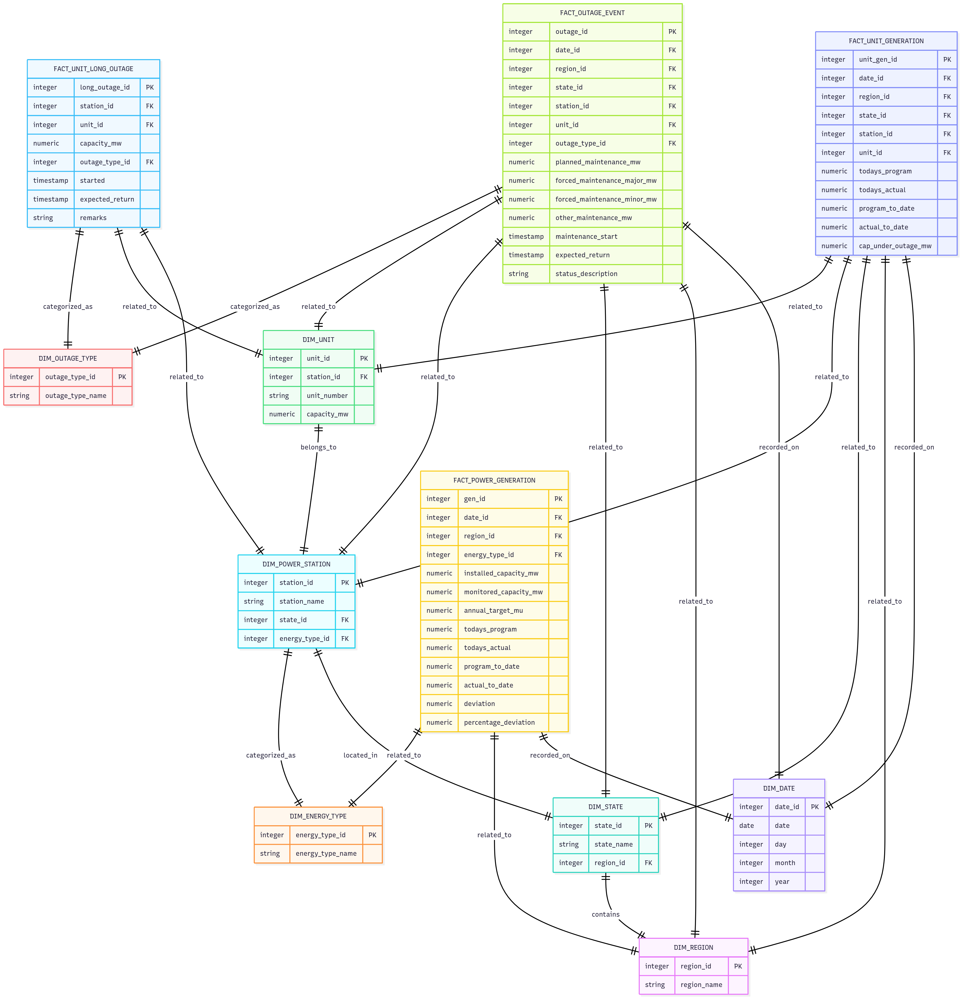

# Schema of the Data stored

As, I have already cleaned the data. I am planning to put into a data warehouse and the best schema for this specific usecase would be Galaxy schema.

Galaxy Schema is a data warehouse schema where you have multiple fact tables that share common dimensional tables.

Why not Star Schema because if i try to force all he data into one fact table, i might end up mixing many level of grains. like mixing regional generation with unit outages.

Snowflake schema is not used here because i want faster retrieval of data than storage optimization.

## Our Schema 

Checkout this chart.



## Code

```
CREATE TABLE dim_region (
    region_id SERIAL PRIMARY KEY,
    region_name VARCHAR(50) UNIQUE NOT NULL
);

CREATE TABLE dim_state (
    state_id SERIAL PRIMARY KEY,
    state_name VARCHAR(50) UNIQUE NOT NULL,
    region_id INTEGER REFERENCES dim_region(region_id)
);

CREATE TABLE dim_energy_type (
    energy_type_id SERIAL PRIMARY KEY,
    energy_type_name VARCHAR(30) UNIQUE NOT NULL
);

CREATE TABLE dim_power_station (
    station_id SERIAL PRIMARY KEY,
    station_name VARCHAR(100) UNIQUE NOT NULL,
    state_id INTEGER REFERENCES dim_state(state_id),
    energy_type_id INTEGER REFERENCES dim_energy_type(energy_type_id)
);

CREATE TABLE dim_unit (
    unit_id SERIAL PRIMARY KEY,
    station_id INTEGER REFERENCES dim_power_station(station_id),
    unit_number VARCHAR(20),
    capacity_mw NUMERIC(10,2),
    UNIQUE (station_id, unit_number)
);

CREATE TABLE dim_date (
    date_id SERIAL PRIMARY KEY,
    date DATE UNIQUE NOT NULL,
    day INTEGER,
    month INTEGER,
    year INTEGER
);

CREATE TABLE dim_outage_type (
    outage_type_id SERIAL PRIMARY KEY,
    outage_type_name VARCHAR(50) UNIQUE NOT NULL
);

CREATE TABLE fact_power_generation (
    gen_id SERIAL PRIMARY KEY,
    date_id INTEGER REFERENCES dim_date(date_id),
    region_id INTEGER REFERENCES dim_region(region_id),
    energy_type_id INTEGER REFERENCES dim_energy_type(energy_type_id),
    installed_capacity_mw NUMERIC(10,2),
    monitored_capacity_mw NUMERIC(10,2),
    annual_target_mu NUMERIC(15,2),
    todays_program NUMERIC(12,2),
    todays_actual NUMERIC(12,2),
    program_to_date NUMERIC(15,2),
    actual_to_date NUMERIC(15,2),
    deviation NUMERIC(12,2),
    percentage_deviation NUMERIC(5,2)
);

CREATE TABLE fact_unit_generation (
    unit_gen_id SERIAL PRIMARY KEY,
    date_id INTEGER REFERENCES dim_date(date_id),
    region_id INTEGER REFERENCES dim_region(region_id),
    state_id INTEGER REFERENCES dim_state(state_id),
    station_id INTEGER REFERENCES dim_power_station(station_id),
    unit_id INTEGER REFERENCES dim_unit(unit_id),
    todays_program NUMERIC(12,2),
    todays_actual NUMERIC(12,2),
    program_to_date NUMERIC(15,2),
    actual_to_date NUMERIC(15,2),
    cap_under_outage_mw NUMERIC(10,2)
);

CREATE TABLE fact_outage_event (
    outage_id SERIAL PRIMARY KEY,
    date_id INTEGER REFERENCES dim_date(date_id),
    region_id INTEGER REFERENCES dim_region(region_id),
    state_id INTEGER REFERENCES dim_state(state_id),
    station_id INTEGER REFERENCES dim_power_station(station_id),
    unit_id INTEGER REFERENCES dim_unit(unit_id),
    outage_type_id INTEGER REFERENCES dim_outage_type(outage_type_id),
    planned_maintenance_mw NUMERIC(10,2),
    forced_maintenance_major_mw NUMERIC(10,2),
    forced_maintenance_minor_mw NUMERIC(10,2),
    other_maintenance_mw NUMERIC(10,2),
    maintenance_start TIMESTAMP,
    expected_return TIMESTAMP,
    status_description TEXT
);

CREATE TABLE fact_unit_long_outage (
    long_outage_id SERIAL PRIMARY KEY,
    station_id INTEGER REFERENCES dim_power_station(station_id),
    unit_id INTEGER REFERENCES dim_unit(unit_id),
    capacity_mw NUMERIC(10,2),
    outage_type_id INTEGER REFERENCES dim_outage_type(outage_type_id),
    started TIMESTAMP,
    expected_return TIMESTAMP,
    remarks TEXT
);

```
    


